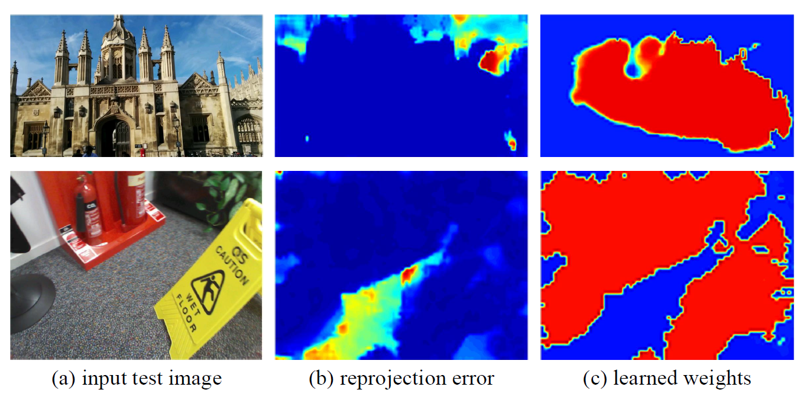
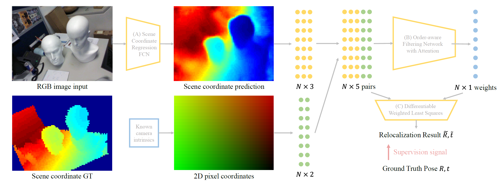

# SC-wLS

This is the official repo for the paper [*SC-wLS: Towards Interpretable Feed-forward Camera Re-localization*]() (ECCV 2022), by Xin Wu\*, Hao Zhao\*, Shunkai Li, Yingdian Cao, and Hongbin Zha.

<div align=center></div>

<div align=center></div>

> we propose a feed-forward camera re-localization method termed SC-wLS that exploits scene coordinate estimates for weighted least squares pose regression. This differentiable formulation exploits a weight network imposed on 2D-3D correspondences, and requires pose supervision only.

For more details, please refer to the [paper](). 

## Requirements

The code in this repo has been tested on Ubuntu 20.04, Python 3.8, and PyTorch 1.9.1 with a nvidia 3090. We recommand to create a virtual conda environment to install them. Other dependencies could be easily installed with pip or conda.

Moreover, the code includes a C++ extension (in the `dsacstar`) of [DSAC\*](https://github.com/vislearn/dsacstar). You could compile and install it by executing:
```bash
cd dsacstar
python setup.py install
```
Note that you need to install opencv (3.4.15) in advance, and change the opencv path in the `setup.py`. 

## Datasets

Download the [7Scenes](https://www.microsoft.com/en-us/research/project/rgb-d-dataset-7-scenes/) dataset and the [Cambridge Landmarks](http://mi.eng.cam.ac.uk/projects/relocalisation/#dataset) dataset.

## Inference

Download the [pretrained models](https://drive.google.com/drive/folders/1FWu1r0e-xHgNF2oUWOt70eu7HZZ4H-LG?usp=sharing) into the repo directory. 

To evaluate on a scene, call:
```bash
python test_e2e_DLT.py <data_path> --dataset <dataset_name> --scene <scene_name> --config_file configs/single_frame.ini --model DenseSC_GNN --pretrained-model <model_path> <--useLM>

```
the `--useLM` option means whether to use LM-Refine in Section 3.5 of the paper.

In order to test the end-to-end training model, for example on the chess scene from the 7Scenes dataset:
```bash
python test_e2e_DLT.py <data_path> --dataset 7Scenes --scene chess -b1 --config_file configs/single_frame.ini --model DenseSC_GNN --pretrained-model ./7scenes_e2e_model/chess/model.pkl

```

In order to test the model after test-time adapatation, for example on the chess scene from the 7Scenes dataset:
```bash
python test_e2e_DLT.py <data_path> --dataset 7Scenes --scene chess -b1 --config_file configs/single_frame.ini --model DenseSC_GNN --pretrained-model ./7scenes_unsup_model/chess/model.pkl 

```

To plot the per-frame errors of the scenes, please refer to the `plot_per_frame` file.

## Training

The training of SC-wLS includes three stages: scene coordinate initialization, weight initialization and end-to-end optimization. These stages use pose supervision only. Meanwhile, you could also use self-supervised adaptation to enhance the test-time performance. 

#### Scene coordinate initialization

To train the scene coordinate network on a scene, call:
```bash
python train_init.py <data_path> --dataset <dataset_name> --scene <scene_name> -b1 --epochs 1500 --config_file configs/single_frame.ini --lr 1e-4 <--cal_training_pose>  --model DenseSC 
```
`--cal_training_pose` decides whether to calculate and record poses when training.

#### Weight initialization and end-to-end optimization

Use `--e2e_training` to specify whether to train the weight network only, or do end-to-end training.
Weight initialization:
```bash
python train_e2e_DLT.py <data_path> --dataset <dataset_name> --scene <scene_name>  -b1 --epochs 1500 --config_file configs/single_frame.ini --glr 1e-4 --model DenseSC_GNN --loss_classif 0.5 --loss_essential 10.0 --obj_geod_th 1.0 --loss_essential_init_epo 0 -Ea 5 -Eb 1e-4 <--cal_training_pose> <--useRANSAC> <--log_val_loss> --pretrained-model <SCNet_model_path>
```
`--useRANSAC` decides whether to output the poses calculated from PnP+RANSAC as well. `--log_val_loss` means whether to record the losses when validation.

End-to-end training:
```bash
python train_e2e_DLT.py <data_path> --dataset <dataset_name> --scene <scene_name>  -b1 --epochs 1500 --config_file configs/single_frame.ini --lr 1e-5 --glr 1e-5 --model DenseSC_GNN --loss_classif 0.5 --loss_essential 10.0 --obj_geod_th 1.0 --loss_essential_init_epo 0 -Ea 5 -Eb 1e-4 --e2e_training <--cal_training_pose> <--useRANSAC> <--log_val_loss> --pretrained-model <SCNet_model_path> --w-model <WeightNet_model_path>
```

`--loss_classif` and `--loss_essential` are weights used to balance the classification loss and the regression loss. `-Ea` and `-Eb` are the $\alpha$ and $\beta$ in Eq. 11. As illustrated in the supplement, one should select proper hyper-parameters to balance the losses. Please refer to the [detailed settings](README_TRAIN.md).

#### Test-time adaptation
To validate the self-supervised test-time adaptation on a scene, call:

```bash
python train_e2e_DLT_unsup.py <data_path> --dataset <dataset_name> --scene <scene_name> -b1 --epochs 1500 --config_file configs/<config_name> --glr 1e-5 --model DenseSC_GNN --pretrained-model <E2E_model_path> --auto_mask --ssim  --use_DLT2T --ph 400 <--cal_training_pose> <--useRANSAC>

```
`--config_file` is `skip1step7.ini` for `7Scenes`, and `skip1step2.ini` for `Cambridge`.

You could also change `--model DenseSC` to train a model based on OANet w/o attention. Ablations could be seen in the supplementary.

Call the scripts with the `-h` option to see a listing of all supported command line arguments.

## Acknowledgements
In this repository, we have used codes from the following repositories. We thank all the authors for sharing great codes.

- [DSAC\*](https://github.com/vislearn/dsacstar)
- [OANet](https://github.com/zjhthu/OANet)
- [Eig-Free](https://github.com/Dangzheng/Eig-Free-release)
- [SuperGlue](https://github.com/magicleap/SuperGluePretrainedNetwork)
- [SfMLearner](https://github.com/tinghuiz/SfMLearner)

## Citation 
 If you find this repository useful, please cite the following paper and consider giving a star:
```

```